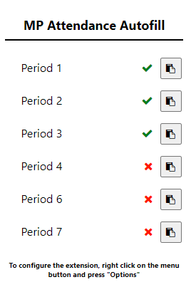

# MPAttendanceAutofill
> An autofill helper for Mountain Pointe High School attendance forms.  

A simple extension for auto-filling Mountain Pointe High School attendance forms and keeping track of them throughout the day. 

## Images

## Files

* popup.js
    * The main file for the extension. Injects a script into an attendance form to auto-fill it, keeps track of when they've been completed, and allows you to easily open class meetings.
* options.js
    * This is where the user configures the extension. Allows them to input all of their class attendance links, meeting links, and their student information.

## Release History

* 2.0
    * Added the ability to easily open meeting links in the extension popup.
    * Added the Google Meet Code Utility (GMCU), an easy way to join meetings from teachers that don't have a permanent conference link
    * Added the ability to create aliases for different classes. For example, you can now have a class labeled as "World History" instead of just "Period 1."
    * Added a preferences section. Includes options such as opening attendance links in new tabs and not automatically submitting forms (for the paranoid; allows you to check the info before manually submitting).
    * Added an experimental "Fill Out All Forms" feature. When enabled in settings, adds a button to the bottom of the popup that will quickly fill out all of your forms for the day. This is basically a "Wednesday Mode."
    * Completely recoded script injection system for auto-filling scripts. Now uses a background script that is much more robust and reliable. Also brings the benefit of allowing auto-completion of all of the attendance forms at once.
    * Added clearer instructions for the basic operation off the extension after criticism of the initial documentation.
    * Heavily improved the layout & styling of the popup and options menus.
    * Added a light theme to the options menu that is triggered by CSS media queries.
    * Improved the comments on many different parts of the source code.
    * Fixed a bug where the red X next to a recently auto-filled form wouldn't change to a green checkmark until the extension menu was closed and re-opened.
    * Fixed a bug where the 10th period attendance link wasn't being saved or displayed properly.
    * Fixed a bug where the form auto-fill would suddenly stop if the popup menu was closed before script injection began.

* 1.1
   * Fixed some small bugs/issues that were reported from the first release.
   * Created a longer time buffer between the data input and the data submission on the form auto-fill script.

* 1.0
    * First Release

## Meta

Mitch Zakocs – mitchell.zakocs@pridetronics.com  

[https://github.com/mzakocs/](https://github.com/mzakocs/)  

Distributed under the MIT License. See ``LICENSE`` for more information.

## How To Use

There are two ways to use this extension:
1. Clone the repository and add the extension through developer mode in Google Chrome. This is not recommended as you will not receive any updates to the extension without regularly pulling from the GitHub repo.
2. Go [https://chrome.google.com/webstore/detail/mountain-pointe-attendanc/haebcphbipdknaapbphajndkgdlmeaig](here) and download the extension from the Chrome store. This is the recommended method as you will automatically receive updates as they are released.

## Contributing

1. Fork it (<https://github.com/mzakocs/MPAttendanceAutofill>)
2. Create your feature branch (`git checkout -b feature/fooBar`)
3. Commit your changes (`git commit -am 'Add some fooBar'`)
4. Push to the branch (`git push origin feature/fooBar`)
5. Create a new Pull Request
